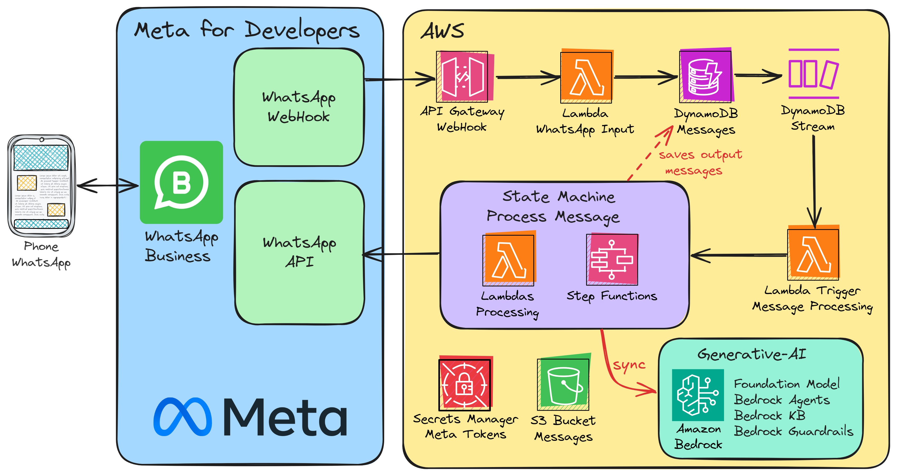

# :scroll: AWS-WHATSAPP-CHATBOT :scroll:

WhatsApp Chatbot on AWS that enables the creation of a customized multi-modal "personal assistant" for general purposes (customized with my own data and requirements)!

## Architecture :memo:

  

## Manual Steps (Only Once) :raised_hand:

### WhatsApp Configurations

These steps show the creation of the "Meta Projects" and settings that will allow us to use WhatsApp Business APIs:

- [WHATSAPP_CONFIGURATION README](./docs/WHATSAPP_CONFIGURATION.md)

### AWS Configurations

These steps show the creation of a Secret on AWS that will contain the required tokens/credentials for connecting AWS and Meta APIs.

- [AWS_CONFIGURATION README](./docs/AWS_CONFIGURATION.md)

## Author 🎹

### Santiago Garcia Arango

<table border="1">
    <tr>
        <td>
            
Curious DevOps Engineer passionate about advanced cloud-based solutions and deployments in AWS. I am convinced that today's greatest challenges must be solved by people that love what they do.

        </td>
        <td>
            

        </td>
    </tr>
</table>

## LICENSE

Copyright 2024 Santiago Garcia Arango.
