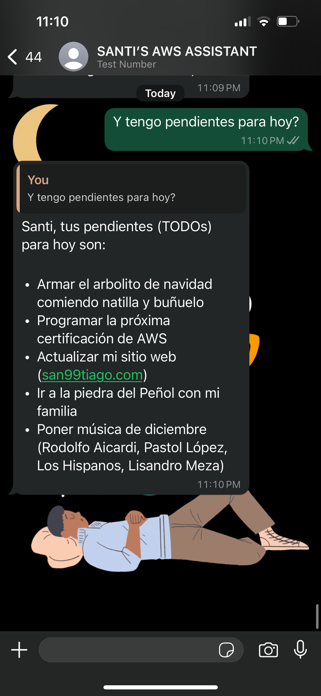

# :scroll: AWS-WHATSAPP-CHATBOT :scroll:

My Serverless WhatsApp chatbot on AWS, serving as a personal assistant with access to my private data.

## Architecture :memo:

  

How is the Generative-AI approach implemented on top of AWS?

- RAG on top of Bedrock Knowledge Bases leveraging an OpenSearch Serverless Vector DB from PDF files.
- Bedrock Agents to enable APIs and Database requests to fetch live data as part of the chain-of-thought process.
- State Machine for different workflow's processing based on the user's input (text, voice-message, etc).

## State Machine Process :fallen_leaf:

The processing of messages is powered by an AWS Step Function that has multiple tasks based on the user's input:

  

## Results (WhatsApp Assistant Demo) 🔮

 

 

## Manual Steps (Only Once) :raised_hand:

### WhatsApp Configurations

These steps show the creation of the "Meta Projects" and settings that will allow us to use WhatsApp Business APIs:

- [WHATSAPP_CONFIGURATION README](./docs/WHATSAPP_CONFIGURATION.md)

### AWS Configurations

These steps show the creation of a Secret on AWS that will contain the required tokens/credentials for connecting AWS and Meta APIs.

- [AWS_CONFIGURATION README](./docs/AWS_CONFIGURATION.md)

## Shoutouts 🙌

Thanks for all the inspiration and guidance on the Generative AI journey:

- [elizabethfuentes12](https://github.com/elizabethfuentes12) -> Gracias, Eli por inspirarme a ser un Developer Advocate!
- [micheldirk](https://medium.com/@micheldirk) -> Thanks Michel for the inspiration for the low-level CDK constructs!

## Author 🎹

### Santiago Garcia Arango

<table border="1">
    <tr>
        <td>
            
Curious Solutions Architect experienced in DevOps and passionate about advanced cloud-based solutions and deployments in AWS. I am convinced that today's greatest challenges must be solved by people that love what they do.

        </td>
        <td>
            

        </td>
    </tr>
</table>

## LICENSE

Copyright 2024 Santiago Garcia Arango.
